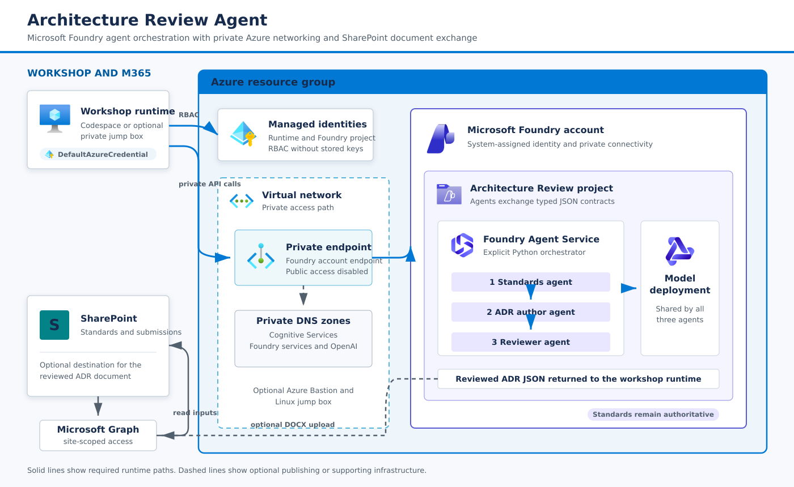

# Architecture Review Agent — Reference Build

A teaching reference for a two-day hands-on session. It builds a
multi-agent Architecture Review Agent on Microsoft Foundry, in pro-code
Python and Bicep.

This is a **progression, not a product**. Each numbered folder is a module
that runs standalone, so someone whose environment breaks at one step can
still pull the next one and keep up. Read it as a curriculum.

## The problem it solves

Someone proposes a technology. Today a human reads the proposal, compares
it against the organization's architecture standards, researches the
technology, writes up where it falls short, and produces an Architecture
Decision Record.

The live build runs a complete four-agent loop behind an orchestrator:
the standards agent evaluates the submission, the research agent adds
approved external context, the ADR author agent drafts the decision record,
and the reviewer agent checks the draft before the reviewed ADR is returned.
Intake and approved-source research remain in the repository as reference
implementations participants can read and pull.

It assists a review board. It does not replace one.

## Architecture



The deployment uses private networking and identity-based authentication
through `DefaultAzureCredential`, with Microsoft Foundry running the agent
workflow. SharePoint input and optional output travel through Microsoft Graph.
See [`docs/architecture.md`](docs/architecture.md) for the detailed agent flow
and design decisions. Service glyphs come from the [official Azure architecture
icon set](https://learn.microsoft.com/azure/architecture/icons/).

## Modules

| Module | What it builds | Status |
|---|---|---|
| `00-setup` | Foundry project and model deployment, plus a validator that proves access | Live build |
| `01-standards-agent` | One agent grounded on the standards library, returning findings with section-level citations | Live build |
| `02-intake` | Structured extraction from an unstructured submission into a typed schema | Reference |
| `03-orchestration` | Standards, research, and ADR author agents wired behind an explicit orchestrator | Live build |
| `04-research` | Standalone reference implementation of allowlisted external research | Reference |
| `05-review-eval` | Reviewer agent over the draft, plus a reference evaluation harness | Live build |
| `06-adr-generation` | ADR author output rendered locally as a DOCX; optional SharePoint write-back | Demonstration |
| `07-auth-harness` | Entra ID sign-in harness in front of the agent chain | Demonstration |

## Getting started

Choose the instructions for the environment where you opened the repository.

### Devcontainer or Codespace

The devcontainer setup installs Azure CLI, Bicep, Python, and the dependencies
for Modules 00 through 06 globally inside the container. Install
`07-auth-harness/requirements.txt` separately before running Module 07. Do not
run `setup-workstation.sh`, and do not create or activate `.venv`.

A Codespace can run the workshop only when `enablePrivateNetworking=false`.
With private networking enabled (the default), a Codespace has no route to the
private endpoint, so use a standalone workstation connected through VPN or
peering, or a jump box connected to the private network.

### Standalone Ubuntu workstation or jump box

On a fresh Ubuntu workstation that can reach the workshop's private endpoint,
clone the repository and run:

```bash
./00-setup/setup-workstation.sh
source .venv/bin/activate
```

[`00-setup/setup-workstation.sh`](00-setup/setup-workstation.sh) installs the
operating-system packages, Azure CLI when needed, a Python environment, and
dependencies for Modules 00 through 06. Optional Bastion extensions are
installed only with `--install-bastion-tools`; package and CLI installation can
be skipped for pre-staged environments. See the setup module's
[network and mirror inventory](00-setup/README.md#network-and-mirror-inventory)
before using a restricted network. Install
`07-auth-harness/requirements.txt` separately before running Module 07. The
script creates `.venv` at the repository root; activate that environment in
each new shell.

After completing the instructions for your environment, follow
[`00-setup/README.md`](00-setup/README.md). Continue when its two required
Microsoft Foundry checks pass. The advisory SharePoint check can remain a
warning unless the workshop flow uses SharePoint input or publishing.

Two things that are easy to miss and cost the most time:

- **Data-plane RBAC is separate from subscription ownership.** Being Owner
  grants you nothing at the data plane. The Bicep assigns Foundry User to the
  entries in `principalIds`. It is the least privilege that allows creating
  and writing agents.
- **Foundry and SharePoint must be in the same tenant.** A Graph token
  issued for one tenant cannot read a site in another.

## Data

Everything in `data/synthetic` is invented. The directory contains three
architecture standards and five technology submissions. The decision
regression gates three deliberately unambiguous submissions:

| Submission | Expected result |
|---|---|
| Member Notification Service | Conforms — a clean approval |
| Northwind Analytics Cloud | Several genuine gaps — approve with conditions |
| QuickShip Document Service | Fails across all three standards — clear rejection |

The conforming case matters as much as the failing ones. Without it, there
is no evidence the system can say yes. SUB-004 is an Azure Container Apps
document-processing case included in quality evaluation. SUB-005 is an
intentionally ambiguous cross-cloud token-exchange case for workshop
discussion; it is quality-scored but does not have a gated decision.

## Conventions

- Python and Bicep. No Terraform.
- Identity-based authentication through `DefaultAzureCredential`. No keys in
  code or `.env` files.
- Each module has its own README and entry point; modules that use Foundry
depend on the shared setup from Module 00.
- Readability over cleverness. People will read this code and extend it.
- No customer names, tenant identifiers, or real URLs anywhere in this
  repository.

## What this is not

Not a production deployment, not a security review, and not a CI/CD
reference. Two days is enough to teach a pattern, not to ship a system.