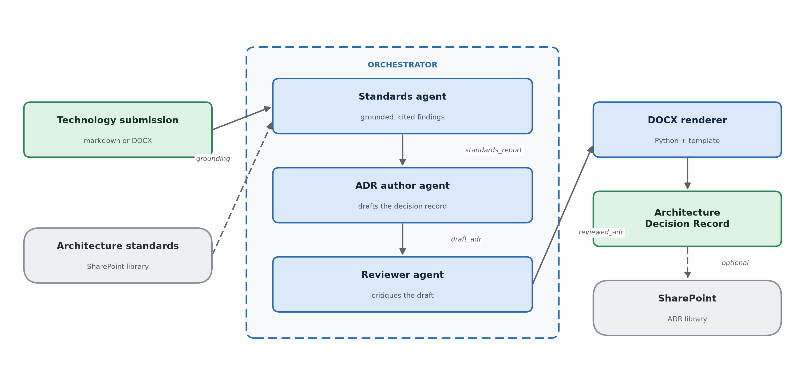

# Architecture

## The flow

## What each agent does

**Standards agent.** Reads the submission and evaluates it against every requirement in the standards library. Each finding carries a status, the quoted evidence from the submission, and a citation naming the standard and section. Status is one of `conforms`, `partially_conforms`, `does_not_conform`, or `not_evidenced`.

The fourth status matters. A submission that simply does not address a requirement is different from one that violates it, and collapsing those two is the fastest way to lose a review board's trust.

**Research agent.** Takes the technology name from the conformance report and searches only customer-approved domains. It returns `TechnologyResearch`, where every external claim has a source title and URL. The domain allowlist is configuration, and every returned URL is validated against it. This step can be skipped while the allowlist or web-search connection is undecided.

**ADR author agent.** Takes the conformance report and optional research findings and produces the content of an Architecture Decision Record: title, decision, drivers, conditions, and consequences. The standards library is authoritative. Research may inform context and consequences but never overrides a standards finding.

**Reviewer agent.** Critiques the draft against the findings it came from, before any human sees it. It looks for two failure modes: claims in the draft that the findings do not support, and findings the draft left out. Each is reported with a severity and the indices of the findings it relates to.

In testing, the reviewer caught the author treating `not_evidenced` findings as outright non-conformances. That is exactly the overreach this agent exists to catch.

## The data contracts

The handoff between agents is a typed schema, not prose. This is the design decision that makes everything else simpler.

| Stage | Produces | Consumed by |
|---|---|---|
| Standards agent | `standards_report` | Research agent, ADR author, reviewer |
| Research agent (optional) | `technology_research` | ADR author |
| ADR author | `draft_adr` | Reviewer |
| Reviewer | `review` with `reviewed_adr` | DOCX renderer |
| DOCX renderer | `.docx` file | SharePoint upload (optional) |

## Reference modules

**Intake (02)** extracts structured fields from an unstructured submission: vendor, capability, data classification, integration points, hosting model. It slots in ahead of the standards agent when submissions arrive in inconsistent formats.

## Design decisions

**Why separate agents rather than one large prompt.** Each agent has one job and one output contract, which makes each independently testable and independently replaceable. It also makes the reviewer possible at all, since a critic needs something separate to critique.

**Why the renderer is code, not a model.** Document layout is deterministic work. Models are good at content and unreliable at format fidelity, so the agent produces structured content and Python renders it into the template.

**Why SharePoint upload is optional.** Graph write permission is the most likely thing to be missing in any given tenant. Isolating it means a missing permission costs you the last step rather than the whole run.

**Why research is optional.** The source allowlist is a customer governance decision, and web search requires a separate Foundry project connection. `--skip-research` keeps standards review and ADR authoring available while either dependency is unresolved.

**Why standards remain authoritative.** External sources describe a technology, but they do not define an enterprise's obligations. Research adds context to the ADR; only the internal standards library determines conformance.

**Why agent versions are deleted by default.** Repeated runs would otherwise accumulate versions. Pass `--keep-agent` to leave them in place and inspect the run in the Microsoft Foundry portal.

## Observability

When the setup deployment provides an Application Insights connection string,
the agent modules configure Azure Monitor OpenTelemetry tracing. An end-to-end
run creates an `Architecture review` trace with a span for each executed stage:
`Standards agent`, `Research agent`, `ADR author agent`, and `Reviewer agent`.
The spans record timing, status, errors, and instrumented dependency calls; they
do not attach submission, standards, research, or ADR content as attributes.

Tracing makes the review path and failures reconstructable without relying on
console output. That evidence matters when an architecture decision must be
auditable, while excluding review payloads reduces unnecessary exposure of
potentially sensitive information.

Application Insights uses public ingestion in this repository, so telemetry
leaves the virtual network even when `enablePrivateNetworking=true`.
Environments that block outbound access to Azure Monitor endpoints, or require
all telemetry to remain on the private network, need an Azure Monitor Private
Link Scope with private endpoints and private DNS. This repository does not
provision one.
