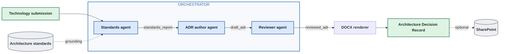

# Architecture

## The flow

## What each agent does

**Standards agent.** Reads the submission and evaluates it against every
requirement in the standards library. Each finding carries a status, the
quoted evidence from the submission, and a citation naming the standard
and section. Status is one of `conforms`, `partially_conforms`,
`does_not_conform`, or `not_evidenced`.

The fourth status matters. A submission that simply does not address a
requirement is different from one that violates it, and collapsing those
two is the fastest way to lose a review board's trust.

**ADR author agent.** Takes the findings and produces the content of an
Architecture Decision Record: title, decision, drivers, conditions, and
consequences. It works from the findings, not from the original
submission, which keeps it grounded in what was actually assessed.

**Reviewer agent.** Critiques the draft against the findings it came from,
before any human sees it. It looks for two failure modes: claims in the
draft that the findings do not support, and findings the draft left out.
Each is reported with a severity and the indices of the findings it
relates to.

In testing, the reviewer caught the author treating `not_evidenced`
findings as outright non-conformances. That is exactly the overreach this
agent exists to catch.

## The data contracts

The handoff between agents is a typed schema, not prose. This is the
design decision that makes everything else simpler.

| Stage | Produces | Consumed by |
|---|---|---|
| Standards agent | `standards_report` | ADR author, reviewer |
| ADR author | `draft_adr` | Reviewer |
| Reviewer | `review` with `reviewed_adr` | DOCX renderer |
| DOCX renderer | `.docx` file | SharePoint upload (optional) |

## Reference modules

Two modules are in the repository as working reference code rather than
part of the live build.

**Intake (02)** extracts structured fields from an unstructured
submission: vendor, capability, data classification, integration points,
hosting model. It slots in ahead of the standards agent when submissions
arrive in inconsistent formats.

**Research (04)** researches the submitted technology from external
sources restricted to a domain allowlist, with every claim carrying a
citation. It slots in alongside the standards agent, and its output feeds
the ADR author as additional context.

## Design decisions

**Why separate agents rather than one large prompt.** Each agent has one
job and one output contract, which makes each independently testable and
independently replaceable. It also makes the reviewer possible at all,
since a critic needs something separate to critique.

**Why the renderer is code, not a model.** Document layout is
deterministic work. Models are good at content and unreliable at format
fidelity, so the agent produces structured content and Python renders it
into the template.

**Why SharePoint upload is optional.** Graph write permission is the most
likely thing to be missing in any given tenant. Isolating it means a
missing permission costs you the last step rather than the whole run.

**Why agent versions are deleted by default.** Repeated runs would
otherwise accumulate versions. Pass `--keep-agent` to leave them in place
and inspect the run in the Microsoft Foundry portal.
